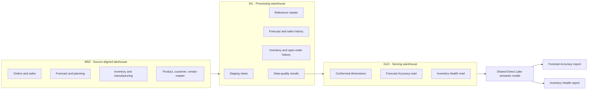
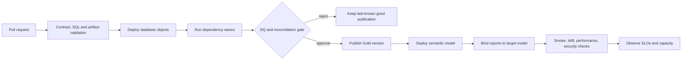

# Fabric Medallion Supply Chain Platform

A sanitized architecture assessment and target-state design for a Microsoft Fabric supply-chain analytics platform. It connects source-aligned operational data to curated history, dimensional marts, a shared Direct Lake semantic model, and two focused Power BI decision products.

> [!IMPORTANT]
> This is an architecture case study, not a production source-code export. It contains aggregate metadata observations, explicit design proposals, and synthetic controls. It excludes real records, credentials, endpoints, tenant/workspace identifiers, organization branding, and proprietary SQL, DAX, pipeline, model, or report definitions.

## Executive summary

The platform separates data preservation, reusable transformation, dimensional serving, metric governance, and report experience into explicit contracts. The current design is directionally strong; the principal control risk is environment drift between deployed database objects, semantic-model bindings, and report bindings.

The target state therefore treats **publication as a controlled state transition**:

1. version database and Fabric artifacts;
2. execute idempotent dependency waves;
3. fail closed on blocking data-quality contracts;
4. publish a last-known-good Gold version;
5. deploy and bind the semantic/report layer to the target environment;
6. prove the release with smoke, drift, performance, and security checks.

This repo is designed to support a system-design discussion: where contracts live, how failures are contained, what is measured, which trade-offs were accepted, and what must change before the platform can be operated predictably at scale.

## Evidence taxonomy

Every claim in this case study belongs to one of three classes:

| Class | Meaning | Examples in this repository |
|---|---|---|
| **Observed** | Reconstructed from read-only metadata on 2026-08-01 | Layer topology, aggregate object counts, dependency graphs, report/model bindings |
| **Inferred** | Architectural interpretation supported by observed structure | Layer responsibilities, likely recovery boundaries, coupling and drift risks |
| **Proposed** | Target control or design starting point; not a claim of current production behavior | SLOs, RTO/RPO, retry policy, RACI, CI gates, capacity triggers |

The portfolio contribution is the sanitized assessment, system-design reasoning, and executable example controls. It does **not** assert sole ownership of the underlying enterprise implementation or unverified business impact.

## Problem and constraints

### Case-study problem

Forecast and inventory decisions depend on many operational grains, snapshot histories, shared reference data, and a large semantic metric surface. Without explicit contracts, a change can be technically valid in one environment yet break refresh, change KPI meaning, or bind a report to the wrong model.

### Design constraints

- Preserve source replayability while keeping report logic out of BRZ.
- Reuse history and reference logic across Forecast Accuracy and Inventory Health.
- Support late-arriving snapshots and bounded historical rebuilds.
- Keep the last trusted Gold publication available when a new batch fails.
- Prevent environment-specific IDs, endpoints, and secrets from entering source.
- Keep platform controls practical for a small delivery team while making ownership explicit.

### Non-goals

- Reproduce proprietary transformations or metric definitions.
- Claim production service levels that were not measured.
- Prescribe a Fabric feature without validating its support and security behavior in the target tenant.

## Quick review paths

- **5 minutes:** this README, then [`docs/current-state-assessment.md`](docs/current-state-assessment.md).
- **15 minutes:** add [`docs/orchestration.md`](docs/orchestration.md), [`docs/reliability-operating-model.md`](docs/reliability-operating-model.md), and [`docs/adr/`](docs/adr/).
- **Engineering review:** inspect [`architecture/layer-contracts.json`](architecture/layer-contracts.json), its [schema](architecture/layer-contracts.schema.json), [validator](scripts/validate_layer_contract.py), and the [fail-closed SQL example](samples/sql/data-quality-gate.sql).

## Current-state architecture

### Observed architecture snapshot

| Layer | Dated observation | Architectural interpretation |
|---|---|---|
| BRZ | Enterprise lakehouse organized by source/domain | Source-aligned reusable operational data |
| SIL | Processing warehouse with 38 curated/control tables in Dev | Keys, history, snapshots, references, and reusable domain logic |
| GLD | Serving warehouse with 15 dimensional/fact tables in Dev | Stable report-ready dimensions and facts |
| Semantic | 27 tables, 22 relationships, 545 domain measures | Central metric and relationship contract |
| Consumption | Two primary seven-page reports | Separate forecast and inventory user journeys |
| Orchestration | 9-step wrapper and 45-activity dependency graph | Coarse operating path plus fine-grained recovery graph |

Counts are architecture evidence, not claims about data volume, performance, or business outcome.

## Decisions and trade-offs

| Decision | Why | Cost accepted | Control/revisit trigger |
|---|---|---|---|
| Separate BRZ, SIL, and GLD responsibilities | Protect replayability and stabilize downstream contracts | More deployment objects and handoffs | Revisit if a layer becomes a pass-through with no independent contract |
| Shared semantic model, separate reports | Reuse governed dimensions/KPIs while preserving distinct journeys | Larger model surface and cross-domain release coordination | Split when ownership, security, scale, or release cadence can no longer be governed together |
| Wrapper plus per-table dependency graph | Simple operator entry point with targeted recovery | Two orchestration views must remain consistent | Generate both from one manifest and fail CI on graph drift |
| Direct Lake consumption | Reduce duplicated import refresh and keep Gold-to-model latency low | Capacity, file-layout, security, and framing guardrails become design inputs | Revisit on repeated fallback/failure, throttling, or query-SLO breach |
| Fail-closed Gold publication | Prevent incomplete or untrusted data from reaching every consumer | A delayed report is preferred to silently incorrect data | Requires agreed exception path and last-known-good recovery |

The detailed rationale and alternatives are captured in [`docs/adr/`](docs/adr/).

## Target reliability envelope

The following values are **proposed starting points**, not observed production results. They require business-owner and capacity-owner approval.

| Objective | Proposed target | Design response |
|---|---:|---|
| Scheduled Gold publication success | ≥ 99% per calendar month | Idempotent rerun, checkpointed waves, last-known-good publication |
| Publication lag after planned source readiness | ≤ 120 minutes for 95% of runs | Critical-path monitoring and dependency-safe parallelism |
| Blocking DQ contract pass rate at publish | 100% | Fail closed; quarantine and alert on any missing, null, or failed result |
| Data recovery point | ≤ one scheduled batch / 24 hours | Replayable BRZ and persisted watermarks |
| Critical consumption recovery time | ≤ 4 hours | Runbooks, rollback binding, and tested Gold recovery boundary |
| Representative report query performance | P95 ≤ 5 seconds | Benchmark model/file layout and investigate capacity throttling |

See [`docs/reliability-operating-model.md`](docs/reliability-operating-model.md) and [`docs/capacity-cost.md`](docs/capacity-cost.md).

## Target release control plane

## Repository map

| Path | Purpose |
|---|---|
| [`docs/e2e-architecture.md`](docs/e2e-architecture.md) | Layer boundaries, grains, evolution, and trust boundaries |
| [`docs/orchestration.md`](docs/orchestration.md) | State machine, retry/recovery, backfill, and CI/CD controls |
| [`docs/data-quality.md`](docs/data-quality.md) | Blocking contracts, observability, and incident routing |
| [`docs/reliability-operating-model.md`](docs/reliability-operating-model.md) | Proposed SLO/RTO/RPO, runbooks, and RACI |
| [`docs/security-governance.md`](docs/security-governance.md) | Identity, least privilege, data protection, and audit controls |
| [`docs/capacity-cost.md`](docs/capacity-cost.md) | Workload isolation, measurement, and scale/cost triggers |
| [`docs/current-state-assessment.md`](docs/current-state-assessment.md) | Dated observations, risks, and 30/60/90-day roadmap |
| [`docs/adr/`](docs/adr/) | Decision records with alternatives and revisit triggers |
| [`architecture/layer-contracts.json`](architecture/layer-contracts.json) | Canonical machine-readable observed/target contract |
| [`architecture/layer-contracts.schema.json`](architecture/layer-contracts.schema.json) | Structural JSON Schema |
| [`scripts/validate_layer_contract.py`](scripts/validate_layer_contract.py) | Dependency, release-control, and confidentiality validator |
| [`scripts/validate_portfolio.py`](scripts/validate_portfolio.py) | Cross-repository machine-contract, link, syntax, and public-release gate |
| [`tests/test_validate_layer_contract.py`](tests/test_validate_layer_contract.py) | Fail-closed regression tests for graph, gate, and portfolio-safety policy |
| [`samples/sql/`](samples/sql/) | Synthetic control-plane and fail-closed publish-gate patterns |
| [`.tours/architect-overview.tour`](.tours/architect-overview.tour) | Guided architecture review in VS Code |

## Related portfolio projects

- [Supply Chain Control Tower Semantic Model](https://github.com/vothai17072002/supply-chain-control-tower-semantic-model)
- [Forecast Accuracy Analytics](https://github.com/vothai17072002/forecast-accuracy-analytics)
- [Inventory Health Control Tower](https://github.com/vothai17072002/inventory-health-control-tower)

## Senior/lead interview discussion

This case study supports a focused discussion of:

- how to turn medallion layer names into enforceable ownership and data contracts;
- how to choose between simple wrapper orchestration and a recoverable dependency DAG;
- how to fail closed without making every incident a full platform rebuild;
- how to separate current-state evidence from target-state recommendations;
- how Direct Lake changes capacity, file-layout, security, and release considerations;
- how to measure reliability, assign ownership, and prioritize Dev/Prod drift remediation;
- how to scale governance without creating a process-heavy delivery bottleneck.

## Public portfolio boundary

The architecture was reconstructed through read-only metadata inspection. The repository contains no real data, email addresses, secrets, company identifiers, workspace or tenant GUIDs, SQL endpoints, internal URLs, proprietary expressions, or deployable production exports. Synthetic controls demonstrate engineering intent without making confidential implementation details public.
