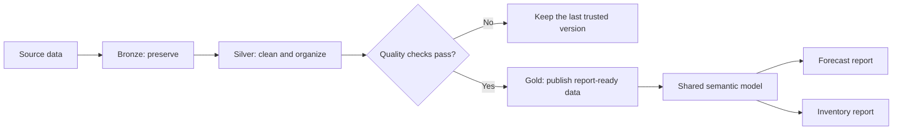

# Fabric Medallion Supply Chain Platform

An architecture case study showing how supply-chain data can move from source systems to trusted Power BI reports in Microsoft Fabric.

The project focuses on the parts that are easy to overlook: clear layer ownership, safe releases, data-quality gates, recovery, and keeping every environment connected to the correct model.

> [!NOTE]
> This is a privacy-safe case study, not a production source-code export. It contains no real records, credentials, endpoints, tenant identifiers, company branding, or proprietary SQL, DAX, pipeline, model, or report definitions.

## In one minute

The platform supports two analytics products—Forecast Accuracy and Inventory Health—through one shared data and metric foundation.

The main idea is simple: a failed or incomplete data load should not quietly replace the last version that users trust.

## A small glossary

| Term | Plain-language meaning |
|---|---|
| Bronze (BRZ) | A replayable copy shaped closely to the source |
| Silver (SIL) | Cleaned, joined, historical, and reusable data |
| Gold (GLD) | Stable, report-ready facts and dimensions |
| Semantic model | Shared relationships and business calculations used by Power BI |
| Data-quality gate | A set of checks that must pass before new data is published |
| Last-known-good | The most recent version that passed its release checks |

## Choose your path

| If you want to... | Start here |
|---|---|
| Understand the current platform and its main risks | Read this page, then [`docs/current-state-assessment.md`](docs/current-state-assessment.md) |
| Explore the end-to-end architecture | [`docs/e2e-architecture.md`](docs/e2e-architecture.md) |
| Understand pipeline retries and recovery | [`docs/orchestration.md`](docs/orchestration.md) |
| Review data-quality rules | [`docs/data-quality.md`](docs/data-quality.md) |
| See reliability, ownership, and incident handling | [`docs/reliability-operating-model.md`](docs/reliability-operating-model.md) |
| Inspect executable contracts and tests | [`architecture/layer-contracts.json`](architecture/layer-contracts.json) and [`tests/test_validate_layer_contract.py`](tests/test_validate_layer_contract.py) |

## What problem does the design solve?

Forecast and inventory reporting depends on snapshots, history, reference data, and hundreds of shared calculations. A change can be valid in one component but still break the full product—for example, a report can point to the wrong model, a model can point to the wrong database, or a partial batch can publish incomplete facts.

This design makes those boundaries explicit and tests them as one release path.

## Architecture snapshot

The following metadata was observed on **2026-08-01**:

| Area | Observed snapshot | Why it matters |
|---|---|---|
| Bronze | Source and domain-aligned lakehouse | Keeps source data reusable and replayable |
| Silver | 38 curated and control tables in Dev | Holds history, reference data, snapshots, and shared domain logic |
| Gold | 15 dimensional and fact tables in Dev | Provides stable, report-ready data |
| Semantic model | 27 tables, 22 relationships, 545 domain measures | Centralizes reusable relationships and metrics |
| Reports | Two primary seven-page reports | Keeps forecast and inventory journeys focused |
| Orchestration | 9-step wrapper and 45-activity dependency graph | Supports a simple operator path and targeted recovery |

These counts describe structure. They do not prove data volume, speed, reliability, or business impact.

## How a safe release works

1. Validate the contracts and source artifacts.
2. Deploy database changes in dependency order.
3. Run the affected data pipelines safely and repeatably.
4. Stop publication if required quality or reconciliation checks fail.
5. Publish a new Gold version only after approval.
6. Deploy and bind the semantic model and reports to the target environment.
7. Run smoke, drift, performance, and security checks.
8. Keep the last trusted version available for recovery.

## Design choices

- Give Bronze, Silver, and Gold a clear responsibility instead of treating them as folder names.
- Share reusable data and metrics while keeping Forecast Accuracy and Inventory Health as separate report experiences.
- Offer one simple pipeline entry point while retaining per-table dependencies for targeted recovery.
- Prefer Direct Lake for governed Gold data, with capacity and fallback behavior measured explicitly.
- Reject incomplete publication rather than silently exposing incorrect data.
- Store environment-specific IDs, endpoints, and secrets outside source control.

Detailed rationale and alternatives are recorded in [`docs/adr/`](docs/adr/).

## Proposed reliability targets

These are starting points for discussion, **not measured production results**:

| Objective | Proposed target |
|---|---:|
| Successful scheduled Gold publications | At least 99% per month |
| Publication delay after planned source readiness | No more than 120 minutes for 95% of runs |
| Required quality checks at publication | 100% pass |
| Data recovery point | No more than one scheduled batch or 24 hours |
| Recovery time for critical reporting | No more than 4 hours |
| Representative report query time | P95 no more than 5 seconds |

Approval, measurement method, and response playbooks are described in [`docs/reliability-operating-model.md`](docs/reliability-operating-model.md) and [`docs/capacity-cost.md`](docs/capacity-cost.md).

## What is in the repository

| Path | What you will find |
|---|---|
| [`docs/e2e-architecture.md`](docs/e2e-architecture.md) | Layer responsibilities, data grain, and trust boundaries |
| [`docs/orchestration.md`](docs/orchestration.md) | Pipeline state, retries, recovery, backfill, and delivery controls |
| [`docs/data-quality.md`](docs/data-quality.md) | Blocking checks, monitoring, and incident routing |
| [`docs/security-governance.md`](docs/security-governance.md) | Identity, least privilege, data protection, and audit controls |
| [`docs/current-state-assessment.md`](docs/current-state-assessment.md) | Dated observations, risks, and a 30/60/90-day roadmap |
| [`docs/adr/`](docs/adr/) | Architecture decision records and revisit conditions |
| [`architecture/layer-contracts.json`](architecture/layer-contracts.json) | Machine-readable layer and release contract |
| [`scripts/validate_layer_contract.py`](scripts/validate_layer_contract.py) | Contract and dependency validator |
| [`samples/sql/`](samples/sql/) | Synthetic control-plane and publication-gate examples |

## Evidence and limits

Every substantive claim is treated as one of three types:

- **Observed:** reconstructed from the dated, read-only metadata snapshot.
- **Inferred:** an interpretation supported by the observed structure.
- **Proposed:** a design or control to validate with the relevant owners.

This repository demonstrates the assessment and design approach. It does not claim sole ownership of an enterprise implementation or business results that were not independently verified.

## Related projects

- [Supply Chain Control Tower Semantic Model](https://github.com/vothai17072002/supply-chain-control-tower-semantic-model)
- [Forecast Accuracy Analytics](https://github.com/vothai17072002/forecast-accuracy-analytics)
- [Inventory Health Control Tower](https://github.com/vothai17072002/inventory-health-control-tower)
