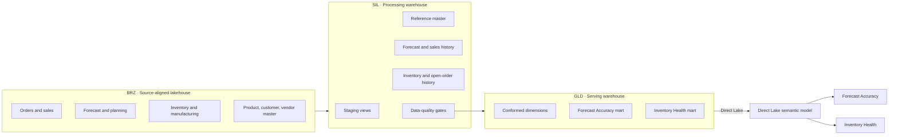

# Fabric Medallion Supply Chain Platform

A sanitized end-to-end architecture case study for a Microsoft Fabric supply-chain analytics platform—from source-aligned lakehouse data through Silver processing, Gold dimensional marts, Direct Lake semantics, and Power BI decision products.

> [!IMPORTANT]
> This repository contains architecture patterns and synthetic examples only. It excludes real data, credentials, endpoints, tenant identifiers, organization branding, and proprietary SQL/DAX/report exports.

## End-to-end architecture

## Verified architecture snapshot

| Layer | Observed structure | Responsibility |
|---|---|---|
| BRZ | Enterprise lakehouse with source/domain-aligned schemas | Preserve reusable operational data at source-aligned grain |
| SIL | Processing warehouse with 38 curated/control tables in Dev | Standardize keys, history, snapshots, references, and domain logic |
| GLD | Serving warehouse with 15 dimensional/fact tables in Dev | Publish report-ready conformed dimensions and facts |
| Semantic | 27 tables, 22 relationships, 545 domain measures | Govern business definitions and report behavior |
| Consumption | Two primary seven-page Power BI reports | Turn governed metrics into planning and inventory decisions |

## Orchestration

Two complementary orchestration styles were verified:

- a **9-step domain wrapper pipeline** for shared reference → forecast Silver → forecast Gold → inventory Silver → inventory Gold;
- a **45-activity per-table pipeline** that expresses dependency waves explicitly and supports targeted recovery.

## Repository map

| Path | Purpose |
|---|---|
| [`docs/e2e-architecture.md`](docs/e2e-architecture.md) | Layer contracts and domain flow |
| [`docs/orchestration.md`](docs/orchestration.md) | Refresh waves, recovery, and deployment controls |
| [`docs/data-quality.md`](docs/data-quality.md) | Quality gates and observability design |
| [`docs/current-state-assessment.md`](docs/current-state-assessment.md) | Sanitized Dev/Prod review findings |
| [`architecture/layer-contracts.yaml`](architecture/layer-contracts.yaml) | Machine-readable contracts for BRZ, SIL, GLD, semantic, and report layers |
| [`samples/sql/data-quality-gate.sql`](samples/sql/data-quality-gate.sql) | Synthetic publish-gate pattern |
| `.tours/architect-overview.tour` | Guided architecture review in VS Code |

## Engineering principles

- Raw/source-aligned data is reusable and does not contain report-specific logic.
- Silver owns cleansing, keys, history, and reusable domain transformations.
- Gold owns dimensional contracts and serving-grain stability.
- Data quality blocks publication before consumption.
- Orchestration expresses dependencies as waves and supports safe reruns.
- Semantic models own business metrics; reports own information hierarchy and interaction design.
- Environment bindings and deployable objects are checked as release artifacts.

## What I can explain in an interview

- Why the design uses separate processing and serving warehouses.
- How metadata-driven refresh reduces duplicated table-load code.
- How to model dependency waves for full refresh and targeted recovery.
- Where data-quality gates should sit in a medallion architecture.
- How conformed dimensions serve both Forecast Accuracy and Inventory Health.
- How Direct Lake changes the handoff between Gold tables and Power BI.
- How to detect and remediate Dev/Prod drift and incorrect report bindings.

## Portfolio safety

The architecture was reconstructed through read-only metadata inspection. Counts are aggregate design evidence; all endpoints, IDs, company-specific logic, source code, records, and branding are excluded.
