# Current-state assessment and roadmap

Assessment date: **2026-08-01**. Scope: read-only metadata for sanitized Dev and Production workspaces, reports, semantic model, warehouses, SQL dependency graph, and orchestration definitions.

## Evidence and limitations

| Evidence class | Included | Not included |
|---|---|---|
| Observed metadata | Item/object inventory, aggregate counts, dependency and binding metadata | Data values, proprietary definitions, endpoints and organization identifiers |
| Architecture inference | Layer responsibilities, coupling, risk and target controls | Claims of organizational approval or current operating process |
| Operational evidence | None represented as achieved | Volume, capacity, latency, SLO history, incidents, access policy and cost |

“Not visible in the inspected catalog snapshot” does not prove an object is absent from all production paths. Findings should be confirmed by the accountable platform owner before remediation.

## What is working well

- Clear source-aligned, processing, serving, semantic, and consumption separation.
- Domain-oriented Silver structures and report-ready Gold marts.
- Shared Calendar, Product, and Warehouse dimensions across forecast and inventory.
- Wrapper and table-level orchestration views expose the dependency shape.
- Development metadata contains DQ/control-plane concepts.
- Two focused reports reuse one semantic contract.

## Prioritized control findings

| ID | Priority | Observation | Risk | Confidence | Proposed control | Target role |
|---|---|---|---|---|---|---|
| F-01 | High | Consumption reports were bound to the development semantic model while a Production model also existed | Non-production changes can affect intended production consumption | High—binding metadata | Environment parameter, pre/post-deploy binding assertion, smoke test | Release Owner |
| F-02 | High | Orchestration and DQ procedures visible in Dev were not visible in the inspected Production catalog snapshot | Recovery and publish controls may not be reproducible across environments | Medium—catalog scope limitation | Version database objects; compare definitions/manifests before pipeline deployment | Platform Lead |
| F-03 | Medium | Gold Dev exposed one additional inventory helper table versus Production | Refresh/model drift and inconsistent query behavior | High—object inventory | Schema/object drift gate plus downstream dependency test | Analytics Engineering Owner |
| F-04 | Medium | Wrapper path is strongly sequential | Longer recovery and larger failure blast radius | High—dependency graph | One manifest, dependency-safe waves, table checkpoints and critical-path measurement | Data Engineering Owner |
| F-05 | Medium | Shared semantic model has a large measure surface | Discoverability, duplication, release and regression risk | High—model metadata | Ownership, folders, naming/descriptions, golden-query and unused-measure governance | Semantic Model Owner |
| F-06 | Medium | Public architecture contract was descriptive but not executable | Documentation and implementation can diverge | High—repo evidence | Canonical JSON, schema, semantic validator and CI | Platform Lead |
| F-07 | Medium | No verified SLO/capacity/security operating evidence was available | Architecture quality cannot be translated into predictable service | High—assessment limitation | Approve SLIs/SLOs, baseline 30 days, assign RACI and test recovery | Platform/Business Owners |

## Root-cause themes

1. **Environment state is implicit.** Binding and object presence are treated as deployment side effects instead of release artifacts.
2. **Control design is stronger than control evidence.** DQ/recovery concepts exist, but production parity and execution proof are incomplete.
3. **Shared assets need explicit ownership.** Reuse increases value and blast radius; metric, dimension, capacity, and exception ownership must be named.
4. **Nonfunctional requirements are undiscovered.** Scale, freshness, recovery, security, and cost decisions cannot be defended without baselines.

## 30/60/90-day remediation roadmap

The roadmap is proposed and must be adjusted to team capacity and business release windows.

### Days 0–30: stop environment and publication ambiguity

| Outcome | Deliverable | Exit measure |
|---|---|---|
| Deterministic promotion | Versioned object/item/binding manifest | Zero unexplained manifest differences in release dry run |
| Fail-closed publication | Expected-contract coverage plus last-known-good state | Missing/null/failed DQ result cannot approve candidate |
| Binding safety | Target model/report binding parameter and assertion | F-01 reproduced in test and prevented by release gate |
| Clear accountability | Named target roles for platform, domain, semantic, BI and release | Every High finding has accountable role and next review date |

### Days 31–60: make recovery and quality measurable

| Outcome | Deliverable | Exit measure |
|---|---|---|
| Scoped recovery | Dependency manifest, checkpoint policy and top-five runbooks | Recovery exercise restores trusted state within proposed RTO |
| Quality ownership | Versioned blocking/advisory contracts and exception flow | 100% expected blocking result coverage per candidate |
| Semantic regression | Golden queries and relationship/measure/binding tests | Breaking change rejected before promotion |
| SLO baseline | 30-day publication/freshness/failure telemetry | Proposed SLOs accepted or revised with evidence |

### Days 61–90: optimize scale, governance and delivery

| Outcome | Deliverable | Exit measure |
|---|---|---|
| Capacity decision model | CU, throttling, critical-path, storage and query benchmark | Scale/scheduling choice documented with measured trade-off |
| Security proof | Identity/access matrix and positive/negative path tests | No unresolved high-risk access exception |
| Controlled parallelism | Measured dependency-safe wave tuning | Lower critical path without SLO or contention regression |
| Governance cadence | Monthly error-budget/drift and quarterly recovery review | Findings trend, owners and remediation decisions retained |

## Recommended target release path

```mermaid
flowchart LR
    G[Versioned Git artifacts] --> C[Validate contract and graph]
    C --> D[Deploy DB/control objects]
    D --> P[Deploy pipelines]
    P --> Q[Candidate load and DQ]
    Q --> M[Publish Gold and deploy model]
    M --> B[Bind reports to target model]
    B --> V[Smoke · drift · access · performance checks]
    V --> O[Observe SLO and capacity]
```

## Success criteria

- Every promoted item and binding is attributable to one release manifest.
- No candidate publishes without complete blocking contract evidence.
- A failed candidate leaves trusted consumption unchanged.
- Recovery and rollback are exercised, timed, and owned.
- Capacity/security decisions use measured evidence rather than hidden assumptions.
- Remaining risk is explicit, time-bound, and accepted by the accountable role.
