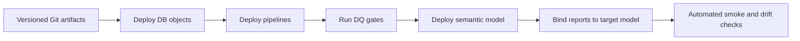

# Current-state assessment

Assessment date: 2026-08-01. Scope: read-only metadata for the supply-chain Dev and Production workspaces, serving reports, semantic model, warehouses, SQL dependency graph, and orchestration definitions.

## What is working well

- Clear separation between source-aligned lakehouse, processing warehouse, serving warehouse, semantic model, and reports.
- Domain-oriented Silver schemas and report-ready Gold marts.
- Shared Calendar, Product, and Warehouse dimensions across forecast and inventory.
- Explicit wrapper and per-table orchestration graphs.
- Data-quality gate objects exist in the development design.
- Reports use one shared Direct Lake semantic model.

## Sanitized control findings

| Priority | Finding | Risk | Recommended control |
|---|---|---|---|
| High | Consumption reports were bound to the development semantic model while a production model also existed | Production audience can depend on non-production changes | Make dataset binding an explicit deployment parameter and post-deploy test |
| High | Orchestration and DQ stored procedures were visible in Dev but not in the Production catalog snapshot | Pipeline recovery or publish gates may not be reproducible across environments | Deploy database objects through versioned CI/CD and compare manifests |
| Medium | Gold Dev contained one additional inventory helper table versus Production | Model/table drift can produce refresh or query inconsistency | Add schema-drift checks before semantic deployment |
| Medium | Wrapper refresh is strongly sequential | Longer recovery time and larger failure blast radius | Use dependency-safe parallel waves and table-level checkpoints |
| Medium | The model has a large measure surface | Discoverability, duplication, and regression risk | Enforce folders, naming, descriptions, ownership, and automated measure tests |

## Recommended target state

The assessment intentionally excludes data values, credentials, organization identifiers, and proprietary source definitions.
