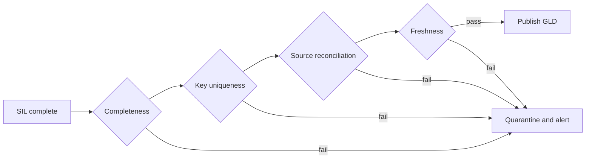

# Data quality and observability

## Quality gates

## Minimum tests

| Dimension | Example control |
|---|---|
| Completeness | Expected source periods and domains are present |
| Uniqueness | Dimension business keys are unique |
| Referential integrity | Fact keys resolve to governed dimensions |
| Reconciliation | Forecast, actual, inventory, and order totals reconcile at agreed grain |
| Validity | Dates, quantities, status codes, and classifications satisfy domain rules |
| Freshness | Latest snapshot meets the published SLA |
| Drift | Required schemas, tables, views, procedures, and bindings match the release manifest |

## Observability contract

Every load writes an audit record containing run ID, environment, object, load mode, watermark/range, source count, target count, rejected count, duration, and final status. Alerts should point to the failed contract and recovery step—not merely say that a pipeline failed.
