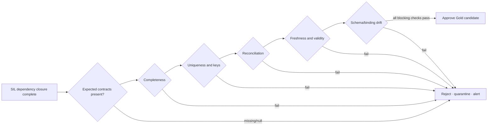

# Data quality and observability

## Quality is a publication contract

Data quality is evaluated before trusted Gold publication. A successful pipeline activity does not imply trustworthy data, and absence of test results is a gate failure—not a pass.

## Contract fields

Every active test declares:

- stable contract ID and version;
- domain, owner role, and affected publication;
- business grain and business date/window;
- blocking or advisory severity;
- executable rule and threshold;
- expected result cardinality;
- remediation/runbook link;
- effective-from and retirement dates.

An execution result records run ID, contract version, observed value, threshold, status, evaluated UTC, diagnostic evidence, and rejected-row location where applicable.

## Minimum blocking controls

| Dimension | Example rule | Default publication behavior |
|---|---|---|
| Contract coverage | Every active blocking contract produced exactly one terminal result | Reject on missing, duplicate, null, or unknown status |
| Completeness | Expected source periods/domains and nonempty critical facts are present | Reject |
| Uniqueness | Governed dimension business keys and fact natural keys are unique | Reject |
| Referential integrity | Fact keys resolve to governed dimensions or explicit unknown member | Reject above approved tolerance |
| Reconciliation | Forecast, actual, inventory, and order totals reconcile at agreed grain | Reject outside approved absolute/relative tolerance |
| Validity | Dates, quantities, status codes, and classifications satisfy domain rules | Reject critical; quarantine noncritical rows per contract |
| Freshness | Latest accepted source/snapshot fits the approved availability window | Reject or formally invoke stale-data exception |
| Drift | Required objects, definitions, dependencies, model/report bindings match release manifest | Reject release |

Thresholds must come from domain risk appetite. “Any difference is failure” is correct for keys and bindings but can be inappropriate for rounded financial or aggregated operational reconciliation.

## Observability contract

Every load writes an audit record containing run ID, parent run ID, environment, object, artifact version, load mode, watermark/range, source count, target count, rejected count, duration, attempt, error class, and final status.

### Service-level indicators

| SLI | Calculation | Target use |
|---|---|---|
| Publication success | Approved scheduled publications / expected publications | Monthly reliability SLO |
| Publication lag | Published UTC − planned source-ready UTC | Freshness SLO |
| Contract coverage | Terminal blocking results / expected active blocking contracts | Must equal 100% per candidate |
| Recovery time | Trusted service restored UTC − incident detected UTC | RTO evidence |
| Data loss/replay window | Oldest unrecoverable accepted change | RPO evidence |
| DQ recurrence | Repeated failure count by contract/root cause | Improvement backlog priority |
| Capacity contention | Critical-path duration and throttling during publish window | Scale/scheduling decision |

The proposed numeric targets are in [`reliability-operating-model.md`](reliability-operating-model.md); they become operational claims only after measured evidence is retained.

## Alert payload and routing

An actionable alert contains domain, environment, run/publication ID, failed contract or activity, business dates affected, consumer impact, last-known-good version, error class, retry state, owner role, and runbook link.

| Severity | Condition | Initial route |
|---|---|---|
| SEV-1 | Incorrect or unauthorized data is actively consumed | Platform Lead, Security/Data Owner, BI Product Owner |
| SEV-2 | Critical publication missed and recovery threatens RTO | On-call engineering and domain owner |
| SEV-3 | Candidate rejected while last-known-good remains within freshness target | Owning engineer during support window |
| Advisory | Nonblocking anomaly with no current consumer impact | Quality backlog owner |

## Quarantine lifecycle

Rejected records or batches retain source reference, run ID, rejection rule, first/last seen time, owner, disposition, and replay link. Quarantine access follows the source classification; it is not a less-secure side channel. Records are resolved, accepted through an auditable exception, or expired under the retention policy.

## Release and incident evidence

- CI proves contract shape and graph semantics.
- Candidate-run evidence proves expected objects, counts, quality, and reconciliation.
- Post-deploy checks prove semantic/report bindings and representative queries.
- Monitoring proves whether proposed SLOs are achieved.
- Incident reviews convert recurring failure classes into contract, automation, or capacity changes.

The synthetic implementation is in [`../samples/sql/control-plane-schema.sql`](../samples/sql/control-plane-schema.sql) and [`../samples/sql/data-quality-gate.sql`](../samples/sql/data-quality-gate.sql).
