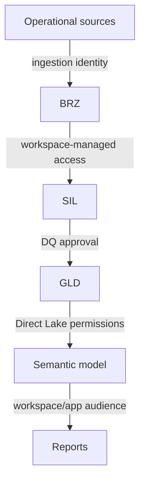

# End-to-end architecture

## BRZ — source-aligned lakehouse

BRZ retains operational data organized by source and business domain. Relevant inputs span orders, invoicing, forecast snapshots, inventory snapshots, manufacturing orders, transfers, product attributes, customers, vendors, and warehouses.

Contract:

- preserve source grain and identifiers;
- add ingestion metadata and load timestamps;
- avoid report-specific joins or KPI logic;
- support replay and lineage into Silver;
- restrict sensitive columns before broader consumption.

## SIL — processing warehouse

SIL converts source-aligned records into reusable curated domains.

| Domain | Examples of responsibility |
|---|---|
| Reference master | Calendar, product, customer, vendor, warehouse, forecast horizon |
| Sales history | Invoice detail and weekly/monthly actual demand |
| Forecast history | Forecast snapshots and naive baseline |
| Open orders | Line-level and monthly open-order position |
| Inventory history | Weekly inventory, ATP, purchase/manufacturing orders, transfers, safety stock, supply plan |
| Data quality | Reconciliation results and publish gates |

Working views isolate transformation logic; curated tables stabilize history and downstream performance. Metadata-driven load procedures apply full, incremental, and date-range refresh patterns.

## GLD — serving warehouse

GLD exposes stable dimensional marts for Direct Lake consumption.

### Shared

- Calendar
- Product
- Warehouse

### Forecast Accuracy mart

- Customer grouping and forecast horizon dimensions
- Forecast-versus-actual fact
- Forecast KPI fact

### Inventory Health mart

- Vendor dimension
- Current snapshot and future-week facts
- Weekly risk classification and substatus aggregates
- Helper tables for outage and internal snapshot logic

## Semantic and report layer

The semantic model creates conformed relationships, reusable KPI families, comparison logic, formatting rules, and explainable narrative measures. Forecast Accuracy and Inventory Health remain separate reports because their user journeys differ, while sharing governed model contracts.

## Trust boundaries

Secrets belong in managed connections; row-level and workspace access must be reviewed independently.
