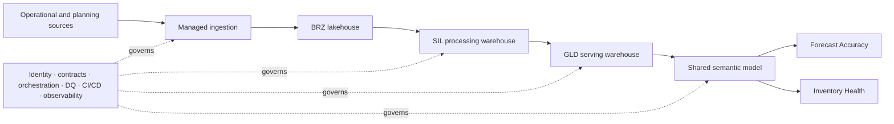
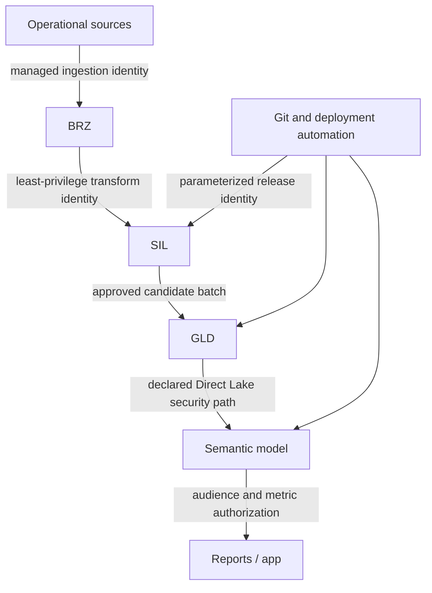

# End-to-end architecture

## Scope and evidence

This document combines a dated, sanitized metadata observation with target-state contracts. **Observed** statements describe the 2026-08-01 snapshot. **Proposed** statements define controls that should be approved and verified before being represented as production behavior.

## System context

The data plane moves source records toward decision-ready models. The control plane owns identity, release evidence, quality, recovery, and environment binding. Keeping those views separate prevents a storage-flow diagram from being mistaken for an operable system design.

## Layer contract summary

| Layer | Observed platform | Target responsibility | Output boundary | Primary owner role |
|---|---|---|---|---|
| BRZ | Fabric lakehouse | Preserve source-aligned facts and replay metadata | Immutable or reproducibly replaceable source-grain batches | Data Platform |
| SIL | Fabric warehouse | Resolve keys, history, reusable domain rules and snapshots | Curated domain tables with stable business keys and load audit | Domain Data Engineering |
| GLD | Fabric warehouse | Publish conformed dimensions and facts | Versioned report-ready dimensional contract | Analytics Engineering |
| Semantic | Power BI Direct Lake model | Govern relationships, KPI definitions and security behavior | Certified metric surface | Semantic Model Owner |
| Consumption | Power BI reports | Present domain-specific decisions and interactions | Tested report experience | BI Product Owner |

The executable version of these target contracts is [`../architecture/layer-contracts.json`](../architecture/layer-contracts.json).

## BRZ — source-aligned lakehouse

**Observed:** the lakehouse is organized around operational sources and domains covering orders, invoicing, forecast snapshots, inventory snapshots, manufacturing orders, transfers, product attributes, customers, vendors, and warehouses.

**Target contract:**

- preserve source grain, identifiers, event time, ingestion time, and batch ID;
- make ingestion replayable through deterministic source/batch boundaries;
- quarantine schema-breaking or malformed input rather than silently coercing it;
- avoid report-specific joins and KPI logic;
- classify and restrict sensitive columns before wider consumption;
- retain enough history to meet the approved recovery point and audit obligation.

BRZ is not an ungoverned dumping ground. A batch is consumable only when its source, schema version, arrival state, and ingestion outcome are known.

## SIL — processing warehouse

**Observed:** Dev exposed 38 curated/control tables spanning shared references, forecast and sales history, open orders, inventory history, and quality control.

| Domain | Target responsibility | Grain examples |
|---|---|---|
| Reference master | Conform calendar, product, customer, vendor, warehouse, forecast horizon | One governed row per business key/effective period |
| Sales history | Standardize invoice detail and demand history | Transaction line and agreed weekly/monthly aggregate |
| Forecast history | Preserve forecast vintages and baseline comparisons | Product/location/customer/horizon/snapshot |
| Open orders | Retain line-level and time-bucketed position | Order line and month bucket |
| Inventory history | Build inventory, ATP, supply-order, transfer and safety-stock history | Product/location/snapshot week |
| Control | Record run, watermark, rejection, reconciliation and publication state | One row per run/object/contract |

Working views may isolate transformation logic, while materialized curated tables stabilize history and repeated downstream access. The boundary is accepted only when business keys, duplicate policy, null policy, effective dating, and load mode are declared.

### Late-arriving and corrected data

- Immutable events use an append watermark plus duplicate protection.
- Correctable snapshots use a bounded date-range replace or merge.
- Reference changes use an explicit Type 1/Type 2 policy per attribute group.
- A correction reopens only the affected dependency window and carries the original and replacement run IDs through audit.
- Downstream Gold publication is rebuilt only for impacted partitions/grains when dependencies prove that is safe.

## GLD — serving warehouse

**Observed:** Dev exposed 15 dimensional/fact tables, including shared dimensions and Forecast Accuracy and Inventory Health marts.

### Shared contract

- Calendar
- Product
- Warehouse

Shared dimensions must have a single key strategy, unknown-member policy, effective-dating behavior, and semantic ownership. A downstream mart cannot reinterpret those contracts privately.

### Forecast Accuracy contract

- customer grouping and forecast-horizon dimensions;
- forecast-versus-actual fact at declared comparison grain;
- KPI-supporting fact where pre-aggregation is justified and reconcilable.

### Inventory Health contract

- vendor dimension;
- current and future-week inventory facts;
- risk classification and substatus aggregates;
- helper structures whose lifecycle is versioned with the mart.

### Publication boundary

Gold is a versioned publication, not simply the latest successful table write. A proposed publish protocol is:

1. build the candidate batch outside the trusted consumption boundary;
2. reconcile the candidate against Silver and the prior publication;
3. execute every active blocking DQ contract;
4. atomically advance the publication state or pointer;
5. preserve the previous trusted version through the agreed rollback window.

The exact physical mechanism—transaction, version column, shadow table, or governed view switch—must be validated against the Fabric Warehouse feature set used by the target environment.

## Semantic and report layer

**Observed:** one model with 27 tables, 22 relationships, and 545 measures serves two seven-page reports.

The shared model is reasonable while both domains can align on:

- conformed dimensions and relationship direction;
- metric ownership, naming, descriptions, formatting, and test coverage;
- release cadence and backward compatibility;
- row/object/column security behavior;
- capacity and query-performance envelope.

The reports remain separate because Forecast Accuracy and Inventory Health have different decision paths. Split the model only when security, ownership, scale, or independent release cadence outweigh reuse.

### Direct Lake decision boundary

“Direct Lake” alone is not a complete operating decision. The release manifest must record the selected Direct Lake mode, framing/automatic-update policy, security interaction, file/row-group guardrails, and permitted fallback or failure behavior. ADR 004 documents the decision questions without claiming that an unobserved setting is active.

## Schema evolution

| Change | Default policy | Required evidence |
|---|---|---|
| Add nullable column | Backward compatible | Contract update and downstream discovery test |
| Rename/drop/type change | Breaking | Versioned migration, impact analysis, consumer approval |
| Grain or key change | Breaking | New contract version and parallel reconciliation |
| New classification/security rule | Security-sensitive | Access test and export-path review |
| Measure behavior change | Semantic breaking change | Golden-query regression and release note |

No environment is promoted based only on object existence; deployed definitions, dependencies, bindings, and smoke-test results form the release evidence.

## Trust boundaries

Workspace roles, item permissions, OneLake/data-plane roles, and semantic RLS/OLS are distinct controls and must be reviewed independently. Admin/Member/Contributor roles are not audience roles. See [`security-governance.md`](security-governance.md).

## Known limits of this case study

No sanitized evidence was available for source volume, batch duration, capacity SKU, query latency, data classification, retention obligations, or actual incident history. Those are explicit discovery items, not assumptions hidden in the design.
