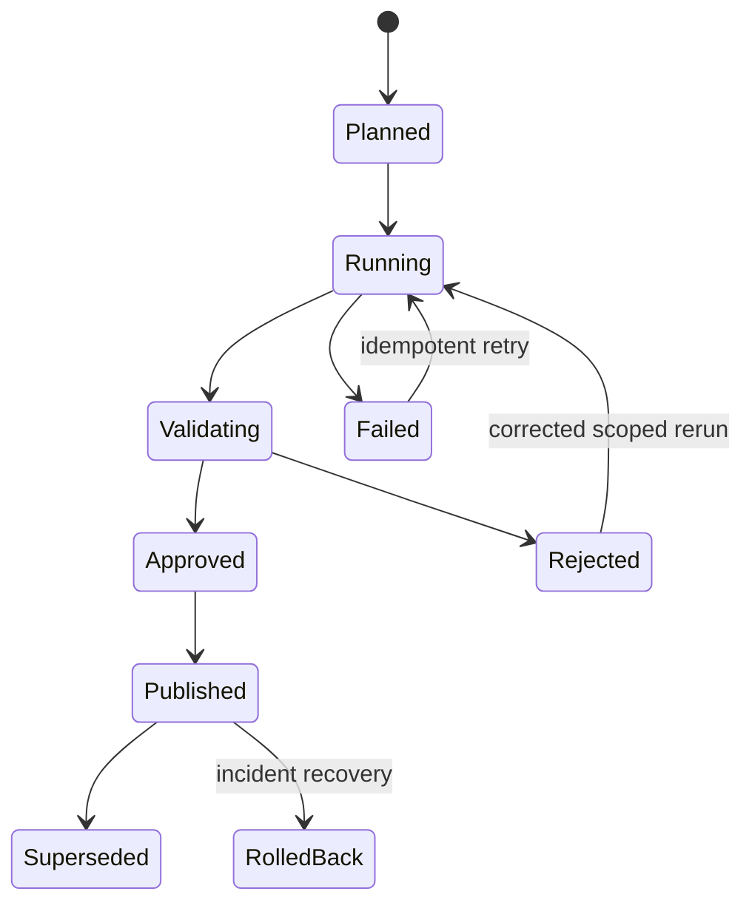

# Orchestration, recovery, and release design

## Evidence boundary

**Observed:** a 9-step domain wrapper and a 45-activity table-level dependency graph were present in the inspected metadata. **Proposed:** the state machine, retry policy, SLOs, recovery procedures, and CI/CD controls below are target controls, not claims about current production operation.

## One dependency graph, two operating views

The wrapper is the operator-facing entry point:

1. Shared reference
2. Forecast Silver wave 1
3. Forecast Silver wave 2
4. Forecast Silver wave 3
5. Forecast Gold
6. Inventory Silver wave 1
7. Inventory Silver wave 2
8. Inventory Silver wave 3
9. Inventory Gold

The 45-activity graph exposes table-level dependencies, parallelism, checkpoints, and targeted recovery. Both views should be generated from or validated against one manifest; manually maintaining two graphs invites dependency drift.

Sequential domain flow favors dependency clarity but extends the critical path. Parallelism is allowed only where the manifest proves no data dependency and capacity testing shows no harmful contention.

## Run and publication state machines

Run state and publication state are separate. A pipeline can finish successfully while its candidate publication is rejected by DQ. Only an approved candidate can become the trusted version.

Every activity records run ID, parent run ID, environment, object, dependency wave, attempt, load mode, watermark/range, source/target/rejected counts, start/end UTC, status, error class, and artifact version.

## Idempotency contract

| Load pattern | Idempotency key | Safe-rerun rule |
|---|---|---|
| Full refresh | object + logical business date + artifact version | Build candidate then replace/switch only after validation |
| Incremental append | source + immutable event ID + watermark window | Deduplicate on source identity; advance watermark only after commit |
| Date-range replace | object + inclusive business-date range | Delete/replace exactly the declared range within one controlled boundary |
| Dimension merge | business key + effective timestamp/version | Deterministic Type 1/Type 2 behavior; no duplicate current row |
| Gold publication | domain + business date + candidate version | An approved version can be published once; repeated call is a no-op or explicit conflict |

Watermarks belong to the control store, not pipeline-local variables. A watermark advances only after its target write and audit record are durable.

## Failure classification and retry policy

| Failure class | Examples | Automatic action | Escalation |
|---|---|---|---|
| Transient platform/network | timeout, temporary service error | Exponential backoff with jitter; maximum 3 attempts | Alert after final attempt or SLO risk |
| Capacity/throttling | CU saturation, queued operation | Bounded retry; reduce concurrency; inspect capacity window | Data Platform/Capacity Owner |
| Authentication/authorization | expired connection, denied identity | No blind retry beyond one validation attempt | Security/Platform Owner |
| Contract/schema | missing column/object, incompatible type | Fail immediately and block downstream graph | Release Owner and domain engineer |
| Data quality | missing period, duplicate key, failed reconciliation | Reject candidate; keep last-known-good | Data Owner and BI Product Owner |
| Logic/unknown | deterministic procedure or expression failure | One scoped reproducibility check, then stop | Owning engineer; incident severity by consumer impact |

Timeouts and retry counts are parameters per activity class. Retrying deterministic failures consumes capacity and delays diagnosis; the error classifier must be part of the orchestration contract.

## Checkpoint and recovery model

- A completed activity is reusable only when its artifact version, input watermark, and dependency versions match the recovery run.
- A rerun creates a new run ID and links to the failed parent; audit history is never overwritten.
- Gold publication waits for complete Silver dependency evidence and all blocking contracts.
- A failed or rejected candidate leaves the last-known-good Gold version and report binding unchanged.
- Recovery starts at the earliest invalidated dependency, not automatically at the first pipeline activity.
- Any manual override records approver role, reason, expiry, affected contracts, and follow-up action; DQ failures are not silently converted to warnings.

## Recovery runbook matrix

| Scenario | Containment | Recovery | Exit evidence |
|---|---|---|---|
| One Silver table fails | Stop dependent nodes; allow independent branches to finish | Fix cause and rerun failed node plus descendants | Matching artifact/input versions; DQ pass |
| Gold candidate fails reconciliation | Do not advance publication | Rebuild affected grain/partition from trusted Silver | Reconciliation within contract threshold |
| Bad Gold version is published | Freeze further publication; assess affected consumers | Switch to prior trusted version and rebind/reframe if required | Smoke test, binding check, incident record |
| Report bound to wrong environment | Remove/limit audience if risk warrants | Apply target binding parameter and redeploy | Report/model/workspace IDs match release manifest |
| Capacity saturation breaches window | Reduce noncritical concurrency | Reschedule or scale after CU analysis | Critical path within target and no throttling |
| Missing Production object | Stop promotion before pipeline invocation | Deploy versioned database artifact first | Manifest equality and executable smoke test |

Target RTO/RPO and incident ownership are defined in [`reliability-operating-model.md`](reliability-operating-model.md).

## Backfill protocol

1. Declare domain, date range, source correction reason, and expected consumers.
2. Calculate dependency closure and capacity impact before execution.
3. Assign a dedicated backfill run ID and isolate its watermark from scheduled ingestion.
4. Build candidate partitions, reconcile against source and unaffected totals, then publish.
5. Reprocess semantic/report caches or framing only when required by the selected Direct Lake mode.
6. Record before/after publication versions and close the correction with owner approval.

Scheduled and backfill runs cannot publish the same domain/date boundary concurrently.

## CI/CD release sequence

1. Validate the canonical layer contract and dependency graph.
2. Compare required schemas, views, tables, procedures, Fabric items, and bindings with the target manifest.
3. Deploy database/control objects before pipelines that invoke them.
4. Parameterize connections and target bindings; never commit endpoints or IDs to public source.
5. Execute representative unit/contract tests and a bounded candidate load.
6. Run DQ and reconciliation gates.
7. Deploy the semantic model and bind reports to the target model.
8. Run smoke, golden-query, performance, access, and drift tests.
9. Store evidence with the release and observe the first scheduled run.

Rollback is a designed path, not “redeploy the old files”: it must restore compatible database objects, publication version, semantic definition, and report binding as one release unit.
